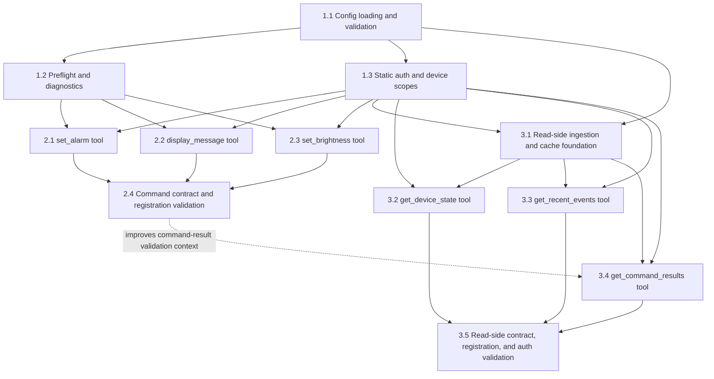
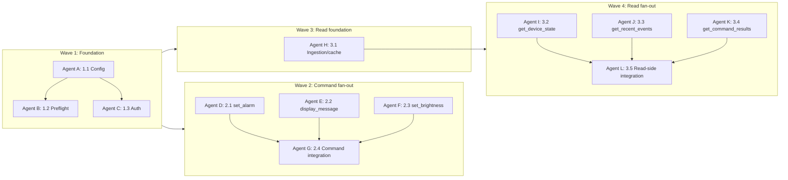

# Story Dependency Order and Parallel Execution Plan

**Project:** mqtt-mcp-server  
**Date:** 2026-06-07  
**Inputs:** `project-docs/planning-artifacts/epics.md`, `project-docs/planning-artifacts/architecture.md`, `project-docs/planning-artifacts/implementation-readiness-report-2026-06-07.md`, `project-docs/implementation-artifacts/sprint-status.yaml`

## Executive Summary

The story set has a clear dependency spine:

1. Epic 1 establishes configuration, preflight, diagnostics, auth, and device authorization.
2. Epic 2 adds write-side command tools. Stories 2.1, 2.2, and 2.3 can run in parallel after Epic 1 foundation is stable, with Story 2.4 as the integration/contract validation story.
3. Epic 3 adds read-side ingestion and query tools. Story 3.1 is the foundation; Stories 3.2, 3.3, and 3.4 can run in parallel after 3.1, with Story 3.5 as the integration/contract validation story.

The best parallelization opportunity is not to start every backlog story at once. The highest-throughput plan is staged parallelism: complete the small foundation first, then fan out on independent command/read tools, then converge on contract validation stories.

Current `sprint-status.yaml` marks all stories as `backlog`. The analysis below is logical dependency order, not a claim that none of the code exists.

## Dependency Table

| Story | Title | Must Follow | Can Run In Parallel With | Reason |
|---|---|---:|---|---|
| 1.1 | Environment Configuration Loading and Validation | None | Limited: planning for 1.2/1.3 | Establishes `MqttConfig`, env loading, secrets, and field-specific validation used by preflight and auth. |
| 1.2 | Startup Preflight and Diagnostic Tool Availability | 1.1 | 1.3 after config fields are stable | Depends on config and known-tool validation. Diagnostics should avoid device auth/publish behavior. |
| 1.3 | Static Token Authentication and Device Scope Enforcement | 1.1 | 1.2 after config fields are stable | Depends on auth mode/token/scope config. Provides shared guard used by all device-scoped tools. |
| 2.1 | Set Alarm Command Tool | 1.1, 1.2, 1.3 | 2.2, 2.3 | Independent command behavior, but touches shared command service/tool registration surfaces. |
| 2.2 | Display Message Command Tool | 1.1, 1.2, 1.3 | 2.1, 2.3 | Independent command behavior, but touches shared command service/tool registration surfaces. |
| 2.3 | Set Brightness Command Tool | 1.1, 1.2, 1.3 | 2.1, 2.2 | Independent command behavior, but touches shared command service/tool registration surfaces. |
| 2.4 | Command Surface Contract and Registration Validation | 2.1, 2.2, 2.3 | 3.1, early 3.2-3.4 if branches are isolated | Integration story that verifies the full command surface, registration, known names, permissions, and exact topic/payload contract. |
| 3.1 | MQTT Read-Side Topic Ingestion and Cache Foundation | 1.1, 1.3 | 2.1, 2.2, 2.3, 2.4 | Establishes topic parsing, callback ingestion, bounded state/event caches, and adapter/service boundaries. |
| 3.2 | Latest Device State Tool | 3.1, 1.3 | 3.3, 3.4 | Depends on cache/query service and auth. Independent read-side query surface. |
| 3.3 | Recent Device Events Tool | 3.1, 1.3 | 3.2, 3.4 | Depends on event cache and auth. Independent read-side query surface. |
| 3.4 | Command Result Visibility Tool | 3.1, 1.3 | 3.2, 3.3 | Depends on command-result events in the event cache. Most useful after Epic 2, but not strictly blocked by Epic 2 implementation. |
| 3.5 | Read-Side Contract, Registration, and Authorization Validation | 3.2, 3.3, 3.4 | Final review/QA only | Integration story that verifies all read-side tools, topic contract, registration, known names, permissions, and auth behavior. |

## Recommended Execution Waves

### Wave 1: Foundation

Run these mostly sequentially, with only light overlap:

1. `1.1-environment-configuration-loading-and-validation`
2. `1.2-startup-preflight-and-diagnostic-tool-availability`
3. `1.3-static-token-authentication-and-device-scope-enforcement`

Parallel note: 1.2 and 1.3 can overlap after 1.1 defines the final config model fields. If agents work in parallel here, assign one owner to config model changes to avoid conflicting edits in `src/mqtt_mcp/config/models.py`, `src/mqtt_mcp/config/loader.py`, and `.env.example`.

### Wave 2: Write-Side Command Fan-Out

After Wave 1, run three command stories in parallel:

- `2.1-set-alarm-command-tool`
- `2.2-display-message-command-tool`
- `2.3-set-brightness-command-tool`

Then run:

- `2.4-command-surface-contract-and-registration-validation`

Parallel risk: these stories all touch `src/mqtt_mcp/services/clock_service.py`, `src/mqtt_mcp/tools/commands.py`, `src/mqtt_mcp/tools/__init__.py`, `src/mqtt_mcp/config/models.py`, and related tests. Parallel work is viable if each agent owns one command and one integration agent resolves registration/known-tool conflicts in 2.4.

### Wave 3: Read-Side Foundation, Overlapping With Write-Side Integration

Story 3.1 can start after Wave 1 and can run in parallel with the Epic 2 command work:

- `3.1-mqtt-read-side-topic-ingestion-and-cache-foundation`

This is a good parallel lane because it should primarily touch new adapter/service modules and tests, such as `adapters/mqtt_subscription_adapter.py`, `services/device_state_service.py`, `services/event_cache.py`, and `tests/unit/adapters/` or `tests/unit/services/`.

### Wave 4: Read-Side Tool Fan-Out

After 3.1, run these in parallel:

- `3.2-latest-device-state-tool`
- `3.3-recent-device-events-tool`
- `3.4-command-result-visibility-tool`

Then run:

- `3.5-read-side-contract-registration-and-authorization-validation`

Parallel risk: these stories share `tools/state.py`, `tools/__init__.py`, `config/models.py`, permissions/preflight tests, and safe error/auth behavior. Keep registration and `KNOWN_TOOL_NAMES` reconciliation for 3.5 unless an earlier story needs it to pass local tests.

## Mermaid: Dependency Graph

## Mermaid: Parallel Work Lanes

## Mermaid: Execution Gantt

```mermaid
gantt
    title Suggested Story Execution Order
    dateFormat  X
    axisFormat  Wave %s

    section Foundation
    1.1 Config loading and validation           :a1, 0, 1
    1.2 Preflight and diagnostics               :a2, after a1, 1
    1.3 Static auth and device scopes           :a3, after a1, 1

    section Write-side commands
    2.1 set_alarm                               :b1, after a3, 1
    2.2 display_message                         :b2, after a3, 1
    2.3 set_brightness                          :b3, after a3, 1
    2.4 Command contract validation             :b4, after b3, 1

    section Read-side visibility
    3.1 Ingestion and cache foundation          :c1, after a3, 1
    3.2 Latest state tool                       :c2, after c1, 1
    3.3 Recent events tool                      :c3, after c1, 1
    3.4 Command results tool                    :c4, after c1, 1
    3.5 Read-side contract validation           :c5, after c4, 1
```

## Parallel Agent Assignment

### Conservative Plan: 3 to 4 Agents

Use this if you want lower merge pressure:

| Agent | Assignment | Notes |
|---|---|---|
| Agent 1 | 1.1, then 1.2 | Owns config/preflight files and avoids split ownership of validation rules. |
| Agent 2 | 1.3 | Owns auth and device-scope tests after 1.1 config fields stabilize. |
| Agent 3 | 2.1, 2.2, 2.3 | Implements command tools serially to avoid repeated conflicts in shared files. |
| Agent 4 | 3.1, then 3.2-3.4 | Builds read-side foundation and tools while Agent 3 completes write-side. |

Run 2.4 and 3.5 as integration/review stories after the corresponding fan-out completes.

### Aggressive Plan: 6 to 8 Agents

Use this if you can tolerate integration overhead:

| Agent | Assignment | Start Gate |
|---|---|---|
| Agent A | 1.1 | Immediately |
| Agent B | 1.2 | After 1.1 config model agreement |
| Agent C | 1.3 | After 1.1 config model agreement |
| Agent D | 2.1 | After 1.2 and 1.3 |
| Agent E | 2.2 | After 1.2 and 1.3 |
| Agent F | 2.3 | After 1.2 and 1.3 |
| Agent G | 3.1 | After 1.1 and 1.3 |
| Agent H | 2.4, then 3.5 | After each epic's implementation stories complete |

After 3.1, add agents for 3.2, 3.3, and 3.4 if capacity is available. This creates the most parallelism but also the highest conflict risk in registration, known tool names, permissions, and tests.

## Conflict Hotspots

These files are likely to be edited by multiple stories and should have a clear owner or an integration step:

- `src/mqtt_mcp/config/models.py`
- `src/mqtt_mcp/config/validation.py`
- `src/mqtt_mcp/server.py`
- `src/mqtt_mcp/tools/__init__.py`
- `src/mqtt_mcp/tools/commands.py`
- `src/mqtt_mcp/tools/permissions.py`
- `src/mqtt_mcp/services/clock_service.py`
- `.env.example`
- `tests/unit/config/test_models.py`
- `tests/unit/config/test_validation.py`
- `tests/unit/tools/test_commands.py`

Read-side work should prefer new modules where possible to reduce conflicts:

- `src/mqtt_mcp/adapters/mqtt_subscription_adapter.py`
- `src/mqtt_mcp/services/device_state_service.py`
- `src/mqtt_mcp/services/event_cache.py`
- `src/mqtt_mcp/tools/state.py`
- `tests/unit/adapters/test_mqtt_subscription_adapter.py`
- `tests/unit/services/test_device_state_service.py`
- `tests/unit/tools/test_state.py`

## BMad Execution Recommendation

For each story, run the standard story cycle in a fresh context window:

1. `[CS] Create Story` using `bmad-create-story`
2. `[VS] Validate Story` using `bmad-create-story` with action `validate`
3. `[DS] Dev Story` using `bmad-dev-story`
4. `[CR] Code Review` using `bmad-code-review`

For the parallel command and read-side fan-out, create story files first so each agent has a stable local contract. Then assign agents to independent story files rather than asking multiple agents to infer scope from the whole epic document.

## Recommended Next Action

Start with `1.1-environment-configuration-loading-and-validation` unless you intentionally want to reconcile sprint status against the current code first. After 1.1 is validated, split 1.2 and 1.3 across two agents, then fan out Epic 2 command stories and Epic 3 read-side foundation.
