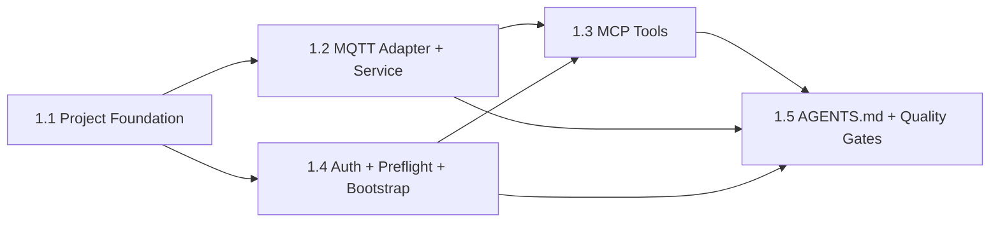

# Story Execution Dependency Graph

## Execution Order

| Story | Depends On | Recommended Agent |
|---|---|---|
| 1.1 Project Foundation | None | dev |
| 1.2 MQTT Adapter + Service | 1.1 | dev |
| 1.4 Auth + Preflight + Bootstrap | 1.1 | dev |
| 1.3 MCP Tools | 1.2, 1.4 | dev |
| 1.5 AGENTS.md + Quality Gates | 1.3, 1.2, 1.4 | tech-writer |

## Key Dependencies

- Story 1.2 and 1.4 can run in parallel after 1.1 completes (different modules — adapters/services vs auth/config/bootstrap).
- Story 1.3 needs both 1.2 (adapter + service) and 1.4 (auth + bootstrap) to be complete.
- Story 1.5 is a capstone that depends on all other stories being complete.
